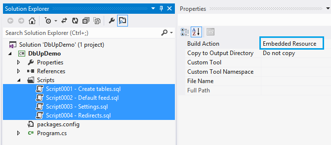
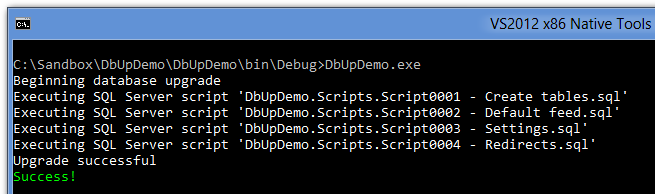
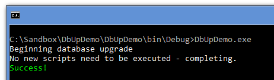

DbUp is a .NET library that helps you to deploy changes to SQL Server databases. It tracks which SQL scripts have been run already, and runs the change scripts that are needed to get your database up to date.

## Upgrading
If you are upgrading from version 3 to 4, see [breaking changes](./breaking-changes). Other release notes are available in [the GitHub releases](https://github.com/DbUp/DbUp/releases). 

## Getting started
Start by creating a simple C# console project in Visual Studio, and adding your SQL scripts to it. From the Properties window, mark them as Embedded Resources:



Next, use NuGet to install the DbUp package:

```
Install-Package DbUp
```

Finally, in `Program.cs`, add the following code:

``` csharp
static int Main(string[] args)
{
    var connectionString =
        args.FirstOrDefault()
        ?? "Server=(local)\\SqlExpress; Database=MyApp; Trusted_connection=true";

    var upgrader =
        DeployChanges.To
            .SqlDatabase(connectionString)
            .WithScriptsEmbeddedInAssembly(Assembly.GetExecutingAssembly())
            .LogToConsole()
            .Build();

    var result = upgrader.PerformUpgrade();

    if (!result.Successful)
    {
        Console.ForegroundColor = ConsoleColor.Red;
        Console.WriteLine(result.Error);
        Console.ResetColor();
#if DEBUG
        Console.ReadLine();
#endif                
        return -1;
    }

    Console.ForegroundColor = ConsoleColor.Green;
    Console.WriteLine("Success!");
    Console.ResetColor();
    return 0;
}
```
**Note**: If you want your application to create the database for you, add the following line after the connection string:

```
EnsureDatabase.For.SqlDatabase(connectionString);
```

This way it will check if the target database exist if not it will create the database and then run your scripts  


You now have a console application that can run change scripts against your database! After running it, you'll see something like this:


The next time you run it, you'll see:


## Why a console application?
By putting your migration scripts in an executable that can be run, you'll get a lot of benefits:

1.  You can hit F5 at any time to test the migration scripts
2.  Other developers on your team can do the same
3.  You can execute them as part of an automated deployment
4.  You can run it during your integration tests
5.  Since it's in your VS solution, it will go into source control along with the rest of your code

Alternatively, instead of a console application, you can create a class library that references DbUp, and embed it into a maintenance screen inside your application.

Check out this blog post to learn more about [the philosophy behind DbUp](./philosophy-behind-dbup.md).

## Other ways to use DbUp
See [usage](./usage.md)
