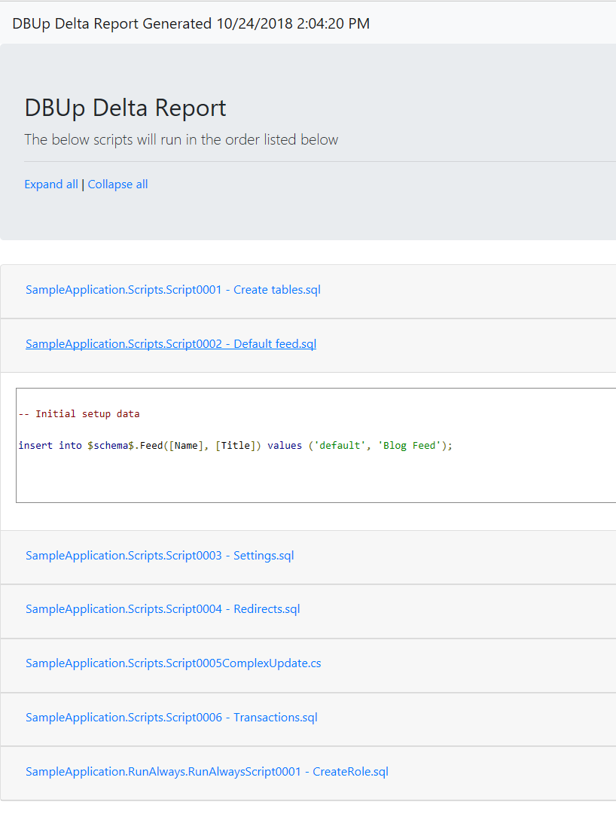

It is important to build trust in any automated process.  Typically, deployment tools have the ability to have approvers who will verify changes prior to being deployed.  A great way to build trust with the approver is to have the ability to see which scripts are going to be run.  Some of these deployment systems have the ability to publish artifacts for approvers to review them.

The ability to generate an HTML report containing all the changes has been added in version 4.2.  This report can then be uploaded as an artifact to the deployment tool of your choice.



This functionality is added by the method "GenerateUpgradeHtmlReport" attached to the upgrader.  Please note this is an extension method, so you will need to import `DbUp.DbUp.Helpers`.

```csharp
static int Main(string[] args)
{
    var connectionString =
        args.FirstOrDefault()
        ?? "Server=(local)\\SqlExpress; Database=MyApp; Trusted_connection=true";

    var upgrader =
        DeployChanges.To
            .SqlDatabase(connectionString)
            .WithScriptsEmbeddedInAssembly(Assembly.GetExecutingAssembly())
            .LogToConsole()
            .Build();

    // --generateReport is the name of the example argument.  You can call it anything
    if (args.Any(a => "--generateReport".Equals(a, StringComparison.InvariantCultureIgnoreCase))) 
    {
        upgrader.GenerateUpgradeHtmlReport("C:\\DeploymentLocation\\UpgradeReport.html");
    }
    else
    {
        var result = upgrader.PerformUpgrade();

        if (!result.Successful)
        {
            Console.ForegroundColor = ConsoleColor.Red;
            Console.WriteLine(result.Error);
            Console.ResetColor();
#if DEBUG
            Console.ReadLine();
#endif                
            return -1;
        }
    }


    Console.ForegroundColor = ConsoleColor.Green;
    Console.WriteLine("Success!");
    Console.ResetColor();
    return 0;
}
```