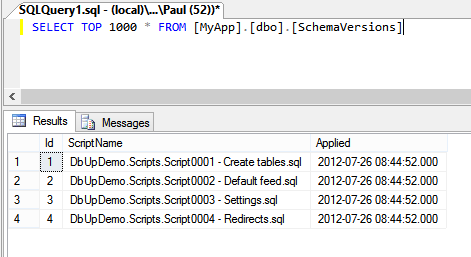

By default, DbUp adds a table to your SQL Server database called SchemaVersions, which tracks the scripts that have already been executed. Before running, DbUp checks this table to work out which scripts should be skipped. After running, it inserts journal records to record the scripts that have been run.



You can change the schema and/or name of this table using the `JournalToSqlTable` extension method:

``` csharp
DeployChanges.To
    .SqlDatabase(connectionString)
    .JournalToSqlTable("MySchema", "MyTable")
    .Build();
```

## NullJournal
If you want to always apply certain scripts -- typically **idempotent** scripts that drop and create things like functions, views, procedures, and permissions -- you can use the `NullJournal` class:

``` csharp
DeployChanges.To
  .SqlDatabase(connectionString)
  .WithScriptsEmbeddedInAssembly(
      Assembly.GetExecutingAssembly(),
      s => s.Contains("everytime"))
  .JournalTo(new NullJournal())
  .Build();
```

## Custom Journal
You can also implement your own `IJournal` to track the scripts yourself. Most parts of DbUp are extensible in this way; just browse the API to see what it can do.
